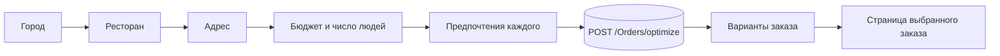

# 🍽️ FoodOptimizer

**Соберите идеальный заказ в ресторане за пару кликов — под ваш бюджет, компанию и вкусы.**


## 📖 О проекте

**FoodOptimizer** — веб-приложение, которое помогает выбрать, что заказать в ресторане. Вы говорите, *где* вы хотите поесть, *сколько* готовы потратить, *на сколько человек* нужен заказ и *что* каждый из вас любит (или не ест) — а сервис возвращает несколько готовых вариантов заказа, которые укладываются в бюджет и подходят под предпочтения.

Это фронтенд-часть проекта. Логика подбора заказов живёт на бэкенде и доступна через REST API; фронтенд отвечает за удобный сценарий ввода параметров, отображение вариантов и работу с ними.

### Зачем это нужно

Заказ на компанию почти всегда превращается в рутину:

- 🤔 в меню десятки позиций, и непонятно, с чего начать;
- 💸 нужно уложиться в бюджет и при этом никого не оставить голодным;
- 👥 у каждого свои предпочтения: кто-то хочет «полегче», кто-то — «посытнее», а кто-то не ест десерты или соусы;
- ⏳ в итоге все тратят время на споры и ручной подсчёт суммы.

FoodOptimizer превращает это в короткий сценарий из трёх шагов: **указали параметры → получили варианты → выбрали понравившийся**.

---

## ✨ Возможности

- **Пошаговый мастер фильтров** из трёх шагов: локация → бюджет → предпочтения.
- **Выбор точки заказа**: город → ресторан → конкретный адрес. Списки подгружаются с бэкенда и зависят друг от друга.
- **Бюджет и размер компании**: слайдер бюджета, число людей (1–20) и число вариантов, которые нужно показать (1–20). Счётчики поддерживают удержание кнопки для быстрого изменения.
- **Индивидуальные предпочтения для каждого человека**:
  - режим сытности — «Легко», «Средне», «Сытно»;
  - желаемые категории — основное блюдо, гарнир, напиток, соус, завтрак, десерт;
  - исключаемые категории.
- **Список вариантов заказа** с итоговой ценой и калорийностью и отдельная страница выбранного варианта.
- **Светлая и тёмная тема** с сохранением выбора между сессиями.
- **Адаптивный интерфейс** — mobile-first, отдельная раскладка для экранов от 1100 px.
- **Модальное окно «О проекте»** — «шторка» на мобильных, окно по центру на десктопе.

---

## 🧭 Как это работает



1. Приложение загружает список городов и ресторанов (`GET Cities`, `GET Brands?city=…`).
2. Пользователь проходит мастер фильтров; состояние хранится в Zustand-сторе.
3. Из фильтров собирается запрос к `POST Orders/optimize`: русские значения интерфейса («Основное блюдо», «Легко») превращаются в значения API (`MainDish`, `Light`).
4. Бэкенд возвращает набор вариантов заказа, а фронтенд показывает их списком.

---

## 🛠️ Технологии

| Область | Инструменты |
| --- | --- |
| **UI** | [React 19](https://react.dev), [React Router 7](https://reactrouter.com) |
| **Язык** | [TypeScript 5.9](https://www.typescriptlang.org) (`strict`) |
| **Сборка** | [Vite 8](https://vite.dev) |
| **Серверное состояние** | [TanStack Query 5](https://tanstack.com/query) — кэширование, зависимые запросы (`enabled`), `queryOptions` |
| **Клиентское состояние** | [Zustand 5](https://zustand-demo.pmnd.rs) — фильтры и тема |
| **Стили** | SCSS Modules, CSS-переменные для тем и дизайн-токенов |
| **Иконки** | [lucide-react](https://lucide.dev) |
| **Качество кода** | ESLint (`simple-import-sort`), Prettier |
| **Деплой** | [Vercel](https://vercel.com) |

### Архитектура

Проект организован по методологии **[Feature-Sliced Design](https://feature-sliced.design)**. Слой может импортировать только из слоёв ниже:

```
app  →  pages  →  widgets  →  features  →  entities  →  shared
```

```
src/
├── app/           Провайдеры, роутинг, глобальные стили и токены тем
├── pages/         Страницы: главная, фильтры, список заказов, страница заказа
├── widgets/       Составные блоки: шапка, модальное окно «О проекте»
├── features/      Пользовательские сценарии: searchFilters, searchDishes
├── entities/      Бизнес-сущности: restaurant, order, orderItem
└── shared/        Переиспользуемое: httpClient, хуки, тема, UI-кит (Modal, BackBtn…)
```

Подробное описание каждого файла, потока данных, API-контракта и рецептов вида «хочу изменить X — иду в Y» — в **[DOCUMENTATION.md](./DOCUMENTATION.md)**.

---

## 🚀 Быстрый старт

### Требования

- Node.js 20+ и npm
- Запущенный бэкенд FoodOptimizer API (или адрес развёрнутого)

### Установка и запуск

```bash
# 1. Клонировать репозиторий (актуальный код — в ветке master)
git clone -b master https://github.com/Dal1elPchel/food-optimizer-frontend-deploy.git
cd food-optimizer-frontend-deploy

# 2. Установить зависимости
npm install

# 3. Указать адрес бэкенда
cp .env.example .env   # или создайте .env вручную

# 4. Запустить dev-сервер
npm run dev
```

### Переменные окружения

| Переменная | Описание | Пример |
| --- | --- | --- |
| `VITE_API_URL` | Базовый URL API. **Обязательно со слэшем на конце** — запросы склеиваются как `BASE_URL + endpoint` | `http://localhost:5001/api/` |

На Vercel задайте переменную в *Project → Settings → Environment Variables*; для продакшена используйте HTTPS-адрес бэкенда.

### Скрипты

| Команда | Что делает |
| --- | --- |
| `npm run dev` | Dev-сервер Vite с HMR |
| `npm run build` | Продакшен-сборка в `dist/` |
| `npm run lint` / `npm run lint:fix` | Проверка кода ESLint (с автоисправлением) |
| `npm run format` | Форматирование Prettier |

---

## 🔌 API

Фронтенд работает со следующими эндпоинтами:

| Метод | Путь | Назначение |
| --- | --- | --- |
| `GET` | `Cities` | Список городов |
| `GET` | `Brands?city=<city>` | Рестораны города и их адреса |
| `POST` | `Orders/optimize` | Подбор вариантов заказа |

<details>
<summary>Пример тела запроса <code>POST Orders/optimize</code></summary>

```json
{
  "restaurantId": "<location.id>",
  "budget": 2000,
  "peoplePreferences": [
    {
      "desiredCategories": ["MainDish"],
      "excludedCategories": ["Dessert"],
      "satiationLevels": ["Light"]
    }
  ],
  "variantsCount": 10
}
```

По одному объекту в `peoplePreferences` на каждого человека. Допустимые значения:
категории — `MainDish | SideDish | Drinks | Sauces | Breakfast | Dessert`,
сытность — `Light | Medium | Heavy`.

</details>

---

## 📍 Текущий статус

Проект активно развивается: базовый сценарий уже работает, часть экранов ещё в процессе доработки.

**Готово**

- [x] Мастер фильтров с валидацией и загрузкой данных с бэкенда
- [x] Сборка и отправка запроса на оптимизацию заказа
- [x] Экраны списка вариантов и выбранного заказа
- [x] Светлая и тёмная темы, адаптивная вёрстка
- [x] Деплой на Vercel

**В работе**

- [ ] Подключение реальных ответов бэкенда на экранах заказов (сейчас там демонстрационные данные)
- [ ] Согласование моделей данных заказа с форматом ответа бэкенда
- [ ] Улучшение обработки ошибок и состояний загрузки
- [ ] Настройка nginx для деплоя
- [ ] Доступность (a11y) и тесты

---

## 🗺️ Вектор развития

FoodOptimizer задуман как продукт, который остаётся **бесплатным в базовом сценарии** и со временем получает **платную версию** для тех, кто пользуется сервисом регулярно и хочет больше контроля над результатом.

### Бесплатная версия

Всё, что нужно для быстрого разового заказа: выбор ресторана, бюджет, число людей, базовые предпочтения (сытность, категории, исключения) и несколько готовых вариантов.

### Платная версия (Premium) — планируется

**💾 Память о ваших выборах**

Сейчас фильтры не сохраняются: после перезагрузки страницы всё нужно вводить заново. В Premium сервис будет запоминать выбор пользователя:

- сохранённые профили предпочтений («я», «жена», «коллеги по офису»), которые подставляются в фильтры в один клик;
- любимые рестораны и адреса;
- избранные варианты заказов (кнопка-сердечко и раздел «Избранное» уже заложены в интерфейсе);
- история прошлых заказов и быстрый повтор.

**🎯 Более уточняющие фильтры**

Расширенные параметры подбора для тех, кому недостаточно базовых:

- более тонкая настройка под конкретного человека — например, ограничения по калориям, диетические предпочтения и аллергены;
- уточнение по составу заказа — например, «обязательно взять эту позицию» или «не больше N блюд одной категории»;
- приоритеты подбора — например, «максимум еды за бюджет» или «минимум калорий».

> Конкретный набор Premium-функций и модель подписки уточняются по мере развития проекта; список выше — направление, а не финальное обещание.

### Что понадобится технически

- аккаунты пользователей и авторизация (JWT + refresh-токены);
- хранение профилей, избранного и истории на бэкенде;
- расширение контракта `Orders/optimize` дополнительными параметрами;
- платёжная интеграция и разграничение доступа между тарифами.

---

## 📂 Ветки

| Ветка | Назначение |
| --- | --- |
| `master` | Актуальная разработка, именно её деплоит Vercel |

---

## 👤 Автор

**Даня** — [@Dal1elPchel](https://github.com/Dal1elPchel)

Если у вас есть идеи или вы нашли баг — создайте [issue](https://github.com/Dal1elPchel/food-optimizer-frontend-deploy/issues).
